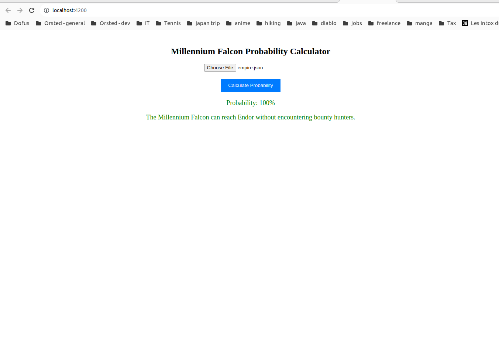

# Notes

It took me quite long, so I had not time to do some enhancement that could have been nice
- A docker compose to run the project
- Some tests in the frontend

If you struggle to run the project, please let me know

# Installation

Please clone the project in your local. If you have a Linux environment, it will make it easier

## Requirement

You need to have npm and node installed on your machine to run the project.

## Run backend

1. Install the NestJS CLI globally by running the following command:

   ```bash
   npm install -g @nestjs/cli

2. Navigate to the backend folder:
    
    ```bash
    cd backend

3. Install the project dependencies:
    
    ```bash
    npm install


4. Start the backend server in development mode:
    ```bash
    npm run start:dev

5. (optional) Run test
    ```bash
    npm run test

## Run script

> Note: Make sure you have the backend server running before running the script.

From the backend folder, you can run the script with the following:

```
node calculate-probability.js path/to/millennium-falcon.json path/to/empire.json
```

Replace path/to/millennium-falcon.json and path/to/empire.json with the paths to your specific JSON files.

**Run Examples:**

1. Run Example1
    ```bash
   cd backend && node calculate-probability.js ../../examples/example1/millennium-falcon.json ../../examples/example1/empire.json

2. Run Example2
    ```bash
   cd backend && node calculate-probability.js ../../examples/example2/millennium-falcon.json ../../examples/example2/empire.json

3. Run Example3
    ```bash
   cd backend && node calculate-probability.js ../../examples/example3/millennium-falcon.json ../../examples/example3/empire.json

4. Run Example4
    ```bash
   cd backend && node calculate-probability.js ../../examples/example4/millennium-falcon.json ../../examples/example4/empire.json

## Run frontend

> Make sure you run the backend first, so the frontend can cal directly the backend

1. Install the NestJS CLI globally by running the following command:

   ```bash
   npm install -g @angular/cli

2. Navigate to the frontend folder:

    ```bash
    cd frontend

3. Install the project dependencies:

    ```bash
    npm install


4. Start the backend server in development mode:
    ```bash
    ng serve --open

You can navigate now to `localost:4300`, upload any config and run the calculations



# Implementation

All implementation are done in Typescript framework as it is the one I am the most confortable

## Backend

### Technical Choice

**Framework**

I used the NestJs framework for the backend to provide tools to run the project. 
My logic if to create few endpoint to be consumable by the frontend and by a node script.

**Techno for the DB**

I used the ORM mikro orm to connect to the SQL DB, when the service start, the module init and connect to the SQLITE db using a **Config file** fetch by a 
Singleton Config managed

**Solution Design**

Each routes in the app.controller.ts are calling a service AppService.ts. They are loading then a class to do all the Algo logic.

**You can find a class of test (I used TDD here for the algo part) at the following file:** `src/algo/probability.calculator.spec.ts`

### Algo solution

All the logic in **src/algo** folder.

I have tried to make the code as clean as possible using a simple class and some good data structure .

The file `src/algo/calculator.structures.ts` contains the main class needed for the algo:
1. **Universe**: Contains the list of all planet in the system and a constructor to build the structure as a **Graph**. Each planet has a weighted vertice 
   to other planet we can reach.
2. **Travel**: Contains all possible travel during the Algo, it keeps track of all actions done during the travel and the current planet we are on. We can 
   navigate all potentiality by trying different travels
3. **Action**: Contains the potential action we can do next in the next travel. It helps us keep track of what we can do, and what are the impact (on 
   fuel, time, etc..) of the action

The algo is using mainly these 3 components to do the logic. You can find all the logic in `src/algo/probability.calculator.ts`
**Look at the method: calculateProbability()**

The concept of the algo is to try all travels and looping as long we have ongoing trip below the empire countdown. For each current travel, we try all 
actions possible until we have reach destination or we don't have time anymore.


